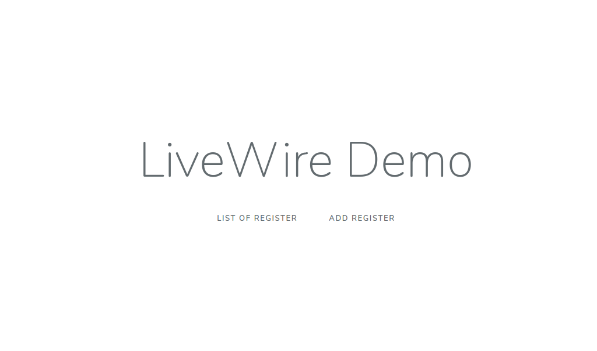
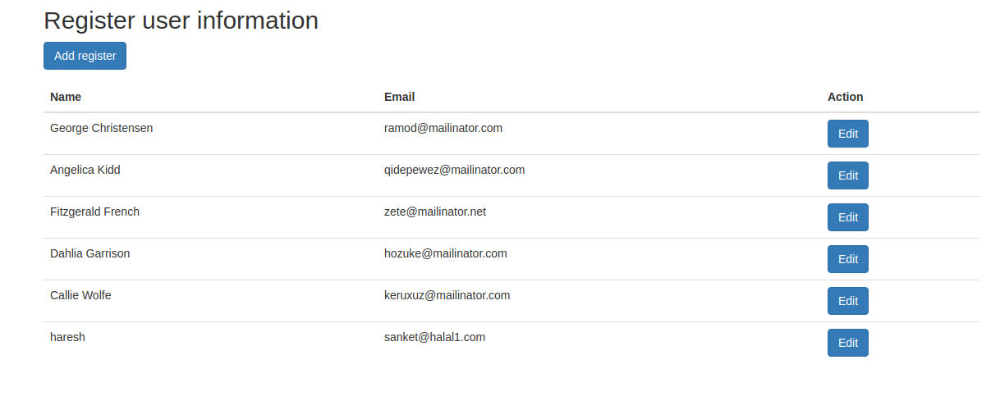
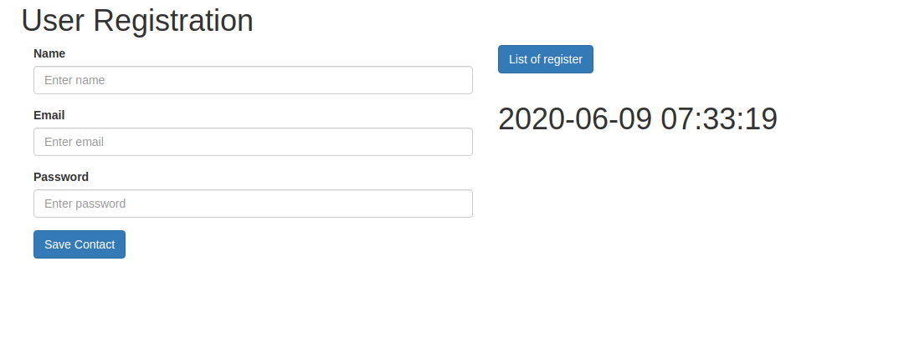

## LiveWire Integration

## Introduction
Livewire simple table & form component is display dynamically table and register form using livewire component.

## Installation

Please check the official laravel installation guide for server requirements before you start. [Official Documentation](https://laravel.com/docs/7.x/installation#installation)

Clone the repository

    git https://github.com/vcian/livewire-integration.git
    
Switch to the repo folder

    cd livewire-integration
    
Install all the dependencies using composer

    composer install

Generate a new application key

    php artisan key:generate

for installation for livewire click here [laravel-livewire](https://laravel-livewire.com/docs/installation) as per that follow the steps and done the installation

Run the database migrations(**Set the database connection in .env before migrating**)

    php artisan migrate

Start the local development server

    php artisan serve
    
    http:://127.0.0.1::[your_port] (By default show two link list of regeter and add laravel-livewire)
    
    http:://127.0.0.1::[your_port]/users (For show all the register user list)
    
    http:://127.0.0.1::[your_port]/user/create (For add user form)
    
   
## Kye points before using this feature
    
    Review App/Http/Livewire/User/ShowUser.php file.
    
    Review App/Http/Livewire/User/Register.php file.
    
    Review resources/views/user.blade.php file.
    
    Review resources/views/listing.blade.php file. 

## ScreenShots

## default page

## list of users

## registration form

## Contributing

Please see [CONTRIBUTING](CONTRIBUTING.md) for details.

## Security

If you discover any security-related issues, please email vishal@viitorcloud.com or haresh.sisodiya@viitor.cloud instead of using the issue tracker.

## Credits

- [Haresh Sisodiya](https://github.com/Hareshsinh)

## License

The MIT License (MIT). Please see [License File](LICENSE.md) for more information.

## Notes

**You can create as many whitelists or blacklist groups as you wish to protect access**
